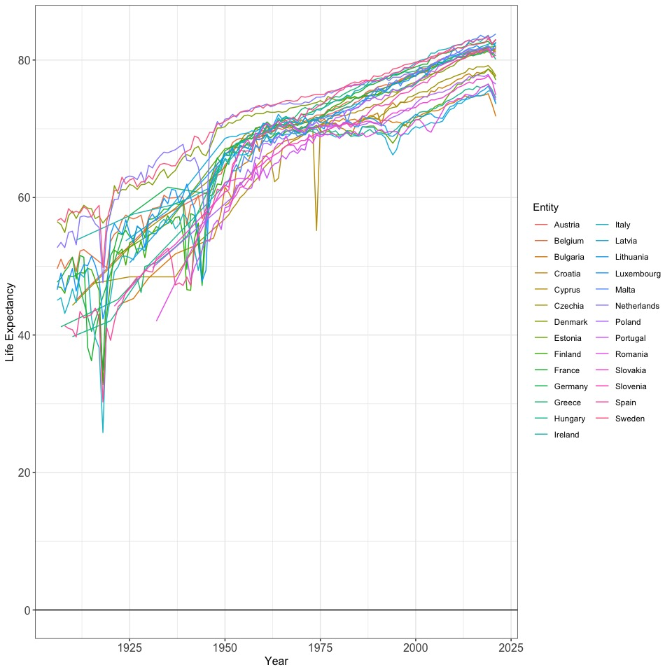
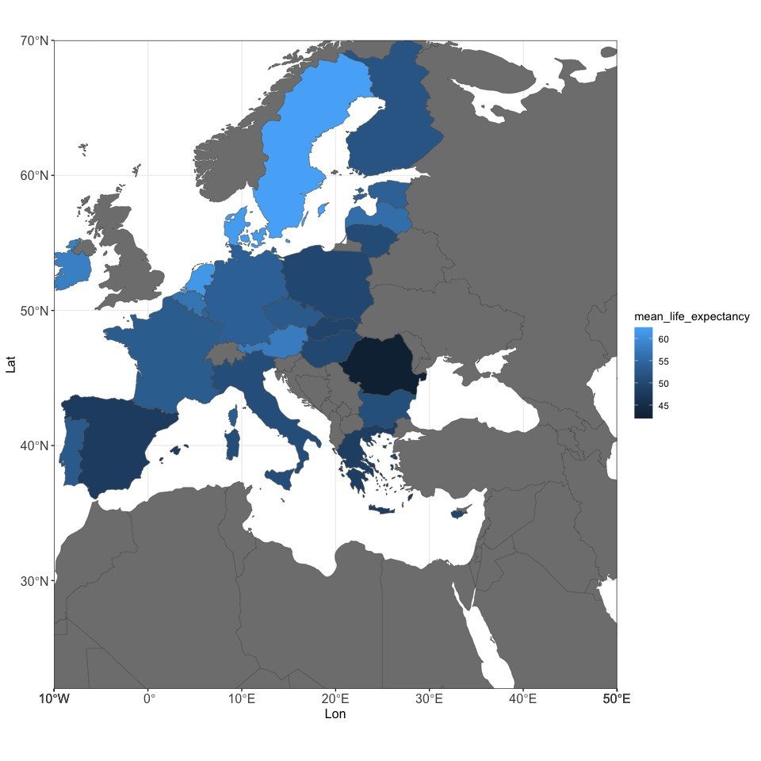
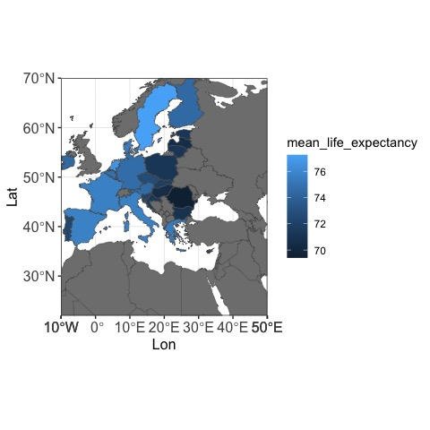
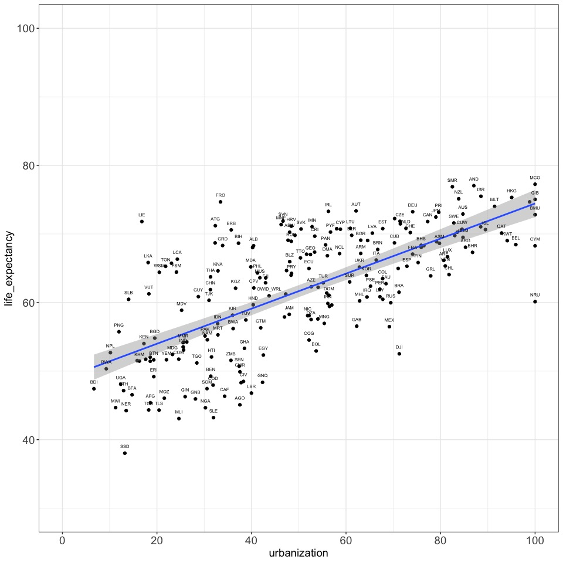

Urbanization and Life Expectancy
================
Bogdan G. Popescu
January 30, 2023

# Introduction

Life expectancy is a measure of the average lifespan of a population. It
is influenced by a variety of factors, including genetics, lifestyle
choices, and environmental conditions. In this memo, we will explore
some of the key drivers of life expectancy and their impact on overall
health and longevity.

One of the major factors that influence life expectancy is access to
quality healthcare. This includes access to preventative care, such as
regular check-ups and screenings, as well as access to advanced medical
treatments and technologies. For example, countries with well-developed
healthcare systems and high levels of investment in medical research
tend to have higher life expectancies. This is because they are able to
provide early diagnoses, effective treatments, and improved quality of
life for individuals with health conditions.

Another important driver of life expectancy is education and income.
Education has been shown to have a direct impact on health outcomes, as
individuals who are well-informed and knowledgeable about their health
are more likely to make healthy lifestyle choices. Additionally, higher
levels of income are correlated with better access to healthcare,
nutritious food, and safe living conditions, all of which contribute to
overall health and longevity.

``` r
#Loading relevant Libraries
library(ggplot2)
library(dplyr)
```

    ## 
    ## Attaching package: 'dplyr'

    ## The following objects are masked from 'package:stats':
    ## 
    ##     filter, lag

    ## The following objects are masked from 'package:base':
    ## 
    ##     intersect, setdiff, setequal, union

# Data Cleaning and Analysis

## Data reading

We first read the relevant datasets from our hardrive.

``` r
setwd("/Users/bgpopescu/Dropbox/john_cabot/teaching/stats/memo")
life_expectancy<-read.csv("./life-expectancy.csv")
literacy_rates<-read.csv("./cross-country-literacy-rates.csv")
electoral_democracy<-read.csv("./electoral-democracy.csv")
gdp<-read.csv("./gdp-per-capita-maddison-2020.csv")
hospital_beds<-read.csv("./number-of-hospital-beds.csv")
urban<-read.csv("./share-of-population-urban.csv")
pop<-read.csv("./UN-population-projection-medium-variant.csv")
```

## Renaming variables

We will now rename the variables of interest.

``` r
names(life_expectancy)[4]<-"life_expectancy"
names(literacy_rates)[4]<-"literacy"
names(gdp)[4]<-"gdp"
names(hospital_beds)[4]<-"beds"
names(urban)[4]<-"urbanization"
names(pop)[4]<-"population"
```

## Selecting literacy

``` r
literacy_rates2<-subset(literacy_rates, select = c("Code", "Year", "literacy"))
literacy_rates2<-subset(literacy_rates2, !is.na(literacy_rates2$Code))
```

## Selecting gdp

``` r
gdp2<-subset(gdp, select = c("Code", "Year", "gdp"))
gdp2<-subset(gdp2, !is.na(gdp2$Code))
```

## Selecting hospital beds

``` r
hospital_beds2<-subset(hospital_beds, select = c("Code", "Year", "beds"))
hospital_beds2<-subset(hospital_beds2, !is.na(hospital_beds2$Code))
```

``` r
names(electoral_democracy)
```

    ## [1] "Entity"                  "Code"                   
    ## [3] "Year"                    "electdem_vdem_owid"     
    ## [5] "electdem_vdem_high_owid" "electdem_vdem_low_owid"

## Selecting democracy

``` r
electoral_democracy2<-subset(electoral_democracy, select = c("Code", "Year", "electdem_vdem_owid"))
electoral_democracy2<-subset(electoral_democracy2, !is.na(electoral_democracy2$Code))
```

## Selecting pop

``` r
pop2<-subset(pop, select = c("Code", "Year", "population"))
pop2<-subset(pop2, !is.na(pop2$Code))
```

## Performing the left join

``` r
urban2<-subset(urban, select = c("Code", "Year", "urbanization"))
urban2<-subset(urban2, !is.na(urban2$Code))
```

``` r
new2<-left_join(life_expectancy, electoral_democracy2, by=c('Code'='Code', 'Year'='Year'))
```

    ## Warning in left_join(life_expectancy, electoral_democracy2, by = c(Code = "Code", : Each row in `x` is expected to match at most 1 row in `y`.
    ## ℹ Row 73 of `x` matches multiple rows.
    ## ℹ If multiple matches are expected, set `multiple = "all"` to silence this
    ##   warning.

``` r
new3<-left_join(new2, gdp2, by=c('Code'='Code', 'Year'='Year'))
```

    ## Warning in left_join(new2, gdp2, by = c(Code = "Code", Year = "Year")): Each row in `x` is expected to match at most 1 row in `y`.
    ## ℹ Row 79 of `x` matches multiple rows.
    ## ℹ If multiple matches are expected, set `multiple = "all"` to silence this
    ##   warning.

``` r
new4<-left_join(new3, urban2, by=c('Code'='Code', 'Year'='Year'))
```

    ## Warning in left_join(new3, urban2, by = c(Code = "Code", Year = "Year")): Each row in `x` is expected to match at most 1 row in `y`.
    ## ℹ Row 205 of `x` matches multiple rows.
    ## ℹ If multiple matches are expected, set `multiple = "all"` to silence this
    ##   warning.

``` r
new5<-left_join(new4, pop2, by=c('Code'='Code', 'Year'='Year'))
```

    ## Warning in left_join(new4, pop2, by = c(Code = "Code", Year = "Year")): Each row in `x` is expected to match at most 1 row in `y`.
    ## ℹ Row 79 of `x` matches multiple rows.
    ## ℹ If multiple matches are expected, set `multiple = "all"` to silence this
    ##   warning.

## Excluding irrelevant countries

``` r
exclusion_list<-c("Western Sahara", "Wallis and Futuna", "Upper-middle-income countries", "United States Virgin Islands", "Turks and Caicos Islands",
"Tokelau",
"Small Island Developing States (SIDS)",
"Sint Maarten (Dutch part)",
"Sao Tome and Principe",
"Saint Martin (French part)",
"Saint Barthlemy",
"More developed regions",
"Montserrat",
"Mayotte",
"Lower-middle-income countries",
"Low-income countries",
"Less developed regions, excluding least developed countries",
"Less developed regions, excluding China",
"Less developed regions",
"Least developed countries",
"Latin America and the Caribbean",
"Land-locked Developing Countries (LLDC)",
"High-income countries",
"Guernsey",
"Bonaire Sint Eustatius and Saba",
"Africa",
"Europe",
"Americas",
"Asia",
"Northern America",
"Oceania")
new6<-subset(new5, !(new5$Entity %in% exclusion_list))
#rm(new5, new6)
```

## Focusing on relevent years

``` r
new7<-subset(new6, Year> 1905)
names(new7)
```

    ## [1] "Entity"             "Code"               "Year"              
    ## [4] "life_expectancy"    "electdem_vdem_owid" "gdp"               
    ## [7] "urbanization"       "population"

``` r
list_ctries<-c("Austria", "Belgium", "Bulgaria", "Croatia", "Cyprus", "Czechia", "Denmark", "Estonia", 
"Finland", "France", "Germany", "Greece", "Hungary", "Ireland", "Italy", "Latvia",
"Lithuania", "Luxembourg", "Malta", "Netherlands", "Poland", "Portugal",
"Romania", "Slovakia", "Slovenia", "Spain", "Sweden")
new7$continent<-NA
new7$continent[new7$Entity %in% list_ctries]<-"EU"
sample<-subset(new7, continent=="EU")
```

# Interpretions

If we focus on Europe, we notice that there has been a substantial
increase in life expectancy. While prior to 1950, the average life
expectancy was 55.17. After the 1950s, the average life expectancy was
73.37 years. The following graph shows the evolution of life expectancy
for a variety of countries starting with 1905 and finishing off with the
present day.

``` r
ggplot(data = sample, aes(x=Year, y=life_expectancy, color=Entity))+
    geom_line()+
    geom_hline(yintercept = 0) +
  labs(x = "Year", y = "Life Expectancy")+
  theme_bw() +
  theme(axis.text.x = element_text(size=12),
        axis.text.x.top  = element_text(size=10, angle = 45, margin=margin(5,5,10,5,"pt")),
        axis.text.y = element_text(size=12),
        axis.title=element_text(size=12),
        plot.title = element_text(hjust = 0.5))
```

<!-- -->

It is also interesting to look at life expectancy on maps prior to 1950s
and after 1950s.

``` r
library("rnaturalearth", "rnaturalearthdata")
world <- ne_countries(scale = "medium", returnclass = "sf")
#Keeping only relevant fields
world<-subset(world, select = c(adm0_a3, sovereignt))
```

``` r
#Creating two samples one before 1950 and one after 1950
sample_before_1950<-subset(sample, Year<1950)%>%
  group_by(Code)%>%
  summarize(mean_life_expectancy = mean(life_expectancy, na.rm=T))
#Merging data to the shape file
world_1950<-left_join(world, sample_before_1950, by = c("adm0_a3"="Code"))
```

``` r
ggplot(data = world_1950) +
    geom_sf(aes(fill = mean_life_expectancy))+
  coord_sf(xlim = c(-10, 50), ylim = c(22, 70), expand = FALSE)+
    labs(x = "Lon", y = "Lat")+
  theme_bw() +
  theme(axis.text.x = element_text(size=12),
        axis.text.x.top  = element_text(size=10, angle = 45, margin=margin(5,5,10,5,"pt")),
        axis.text.y = element_text(size=12),
        axis.title=element_text(size=12),
        plot.title = element_text(hjust = 0.5))
```

<!-- -->

``` r
#Creating the sample after 1950
sample_after_1950<-subset(sample, Year>1950)%>%
  group_by(Code)%>%
  summarize(mean_life_expectancy = mean(life_expectancy, na.rm=T))
#Merging data to the shape file
world_after_1950<-left_join(world, sample_after_1950, by = c("adm0_a3"="Code"))
```

``` r
ggplot(data = world_after_1950) +
    geom_sf(aes(fill = mean_life_expectancy))+
  coord_sf(xlim = c(-10, 50), ylim = c(22, 70), expand = FALSE)+
    labs(x = "Lon", y = "Lat")+
  theme_bw() +
  theme(axis.text.x = element_text(size=12),
        axis.text.x.top  = element_text(size=10, angle = 45, margin=margin(5,5,10,5,"pt")),
        axis.text.y = element_text(size=12),
        axis.title=element_text(size=12),
        plot.title = element_text(hjust = 0.5))
```

<!-- -->

Overall, we see a notable increase in life expectant between the period
before 1950 and the period after. It is also important to understand the
main factors which could be impacting life expectancy. In the following
section, I attempt a multivariate regression to understand what are the
main correlated of life expectancy.

# Statistical Analysis

I attempt two models. In one, I simply control for the level of
urbanization. The main hypothesis that I am testing is that *more
urbanization should have a positive impact on life expectancy*. The
argument is that more urbanization means more access to hospitals and
sanitation, which should be associated with better health outcomes, and
hence, higher life expectancy. However, it is also important to test if
this relationship holds once we control for other relevant variables.
Such variables could be GDP, population size, and level of democracy.
Given, that this is a panel dataset (cross-sectiom time-series), I am
also including country and year fixed effects.

``` r
library(stargazer)
```

    ## 
    ## Please cite as:

    ##  Hlavac, Marek (2022). stargazer: Well-Formatted Regression and Summary Statistics Tables.

    ##  R package version 5.2.3. https://CRAN.R-project.org/package=stargazer

``` r
new7$log_gdp<-log(new7$gdp)
new7$log_pop<-log(new7$population)

lm1<-lm(life_expectancy~urbanization + factor(Code) + factor(Year), data = new7)
lm2<-lm(life_expectancy~urbanization + log_gdp + log_pop + electdem_vdem_owid+
          factor(Code) + factor(Year), data = new7)

model_lst = list(lm1, lm2)

stargazer(model_lst, 
          keep = c("urbanization", "log_gdp", "log_pop", "electdem_vdem_owid"),
          covariate.labels = c("urbanization", "Log GDP", "Log Pop.", "Electoral Democracy"),
          dep.var.labels = "Life Expectancy",
          header=FALSE,
          type = 'html')
```

<table style="text-align:center">
<tr>
<td colspan="3" style="border-bottom: 1px solid black">
</td>
</tr>
<tr>
<td style="text-align:left">
</td>
<td colspan="2">
<em>Dependent variable:</em>
</td>
</tr>
<tr>
<td>
</td>
<td colspan="2" style="border-bottom: 1px solid black">
</td>
</tr>
<tr>
<td style="text-align:left">
</td>
<td colspan="2">
Life Expectancy
</td>
</tr>
<tr>
<td style="text-align:left">
</td>
<td>
\(1\)
</td>
<td>
\(2\)
</td>
</tr>
<tr>
<td colspan="3" style="border-bottom: 1px solid black">
</td>
</tr>
<tr>
<td style="text-align:left">
urbanization
</td>
<td>
0.118<sup>\*\*\*</sup>
</td>
<td>
0.075<sup>\*\*\*</sup>
</td>
</tr>
<tr>
<td style="text-align:left">
</td>
<td>
(0.005)
</td>
<td>
(0.007)
</td>
</tr>
<tr>
<td style="text-align:left">
</td>
<td>
</td>
<td>
</td>
</tr>
<tr>
<td style="text-align:left">
Log GDP
</td>
<td>
</td>
<td>
1.348<sup>\*\*\*</sup>
</td>
</tr>
<tr>
<td style="text-align:left">
</td>
<td>
</td>
<td>
(0.103)
</td>
</tr>
<tr>
<td style="text-align:left">
</td>
<td>
</td>
<td>
</td>
</tr>
<tr>
<td style="text-align:left">
Log Pop.
</td>
<td>
</td>
<td>
4.973<sup>\*\*\*</sup>
</td>
</tr>
<tr>
<td style="text-align:left">
</td>
<td>
</td>
<td>
(0.173)
</td>
</tr>
<tr>
<td style="text-align:left">
</td>
<td>
</td>
<td>
</td>
</tr>
<tr>
<td style="text-align:left">
Electoral Democracy
</td>
<td>
</td>
<td>
0.917<sup>\*\*\*</sup>
</td>
</tr>
<tr>
<td style="text-align:left">
</td>
<td>
</td>
<td>
(0.266)
</td>
</tr>
<tr>
<td style="text-align:left">
</td>
<td>
</td>
<td>
</td>
</tr>
<tr>
<td colspan="3" style="border-bottom: 1px solid black">
</td>
</tr>
<tr>
<td style="text-align:left">
Observations
</td>
<td>
12,862
</td>
<td>
9,005
</td>
</tr>
<tr>
<td style="text-align:left">
R<sup>2</sup>
</td>
<td>
0.914
</td>
<td>
0.933
</td>
</tr>
<tr>
<td style="text-align:left">
Adjusted R<sup>2</sup>
</td>
<td>
0.913
</td>
<td>
0.931
</td>
</tr>
<tr>
<td style="text-align:left">
Residual Std. Error
</td>
<td>
3.343 (df = 12590)
</td>
<td>
3.072 (df = 8783)
</td>
</tr>
<tr>
<td style="text-align:left">
F Statistic
</td>
<td>
496.074<sup>\*\*\*</sup> (df = 271; 12590)
</td>
<td>
554.041<sup>\*\*\*</sup> (df = 221; 8783)
</td>
</tr>
<tr>
<td colspan="3" style="border-bottom: 1px solid black">
</td>
</tr>
<tr>
<td style="text-align:left">
<em>Note:</em>
</td>
<td colspan="2" style="text-align:right">
<sup>*</sup>p\<0.1; <sup>**</sup>p\<0.05; <sup>***</sup>p\<0.01
</td>
</tr>
</table>

The results in the table indicate the level of urbanization is
positively correlated with life expectancy at 5% level. Every unit
increase in urbanization is associated with 0.118 unit increase in life
expectancy. In other words, 10 percentage points increase in
urbanization should be associated with 0.118 \* 10 = 1.18 years. The
effect goes down slightly in model 2, where we control for other
relevant covariates. *Holding everything else constant*, every unit
increase in urbanization is statistically associated with a 0.075 unit
increase in life expectancy.

This relationship is also visible if we do scatterplot with average
country values for the entire period. The results in the next figure
show precisely the relationship between urbanization and life
expectancy: higher levels of urbanization are associated with higher
life expectancy.

``` r
new8<-new7%>%
  group_by(Code)%>%
  summarize(urbanization=mean(urbanization, na.rm=T),
            life_expectancy=mean(life_expectancy, na.rm=T))

figure1<-ggplot(new8, aes(x=urbanization, y=life_expectancy)) +
  geom_point() + 
  geom_smooth(method = "lm")+
  theme_bw()+
  geom_text(aes(label = Code),
              size = 2, 
              check_overlap = TRUE, position = position_nudge(y = 1))+
  scale_x_continuous(name = "urbanization", breaks=seq(0,100,20), 
                     limits = c(0,100))+
  scale_y_continuous(name = "life_expectancy", breaks=seq(0,100,20), 
                     limits = c(30,100))+
  theme(axis.text.x = element_text(size=14),
        axis.text.y = element_text(size=14),
        axis.title=element_text(size=14),
        plot.title = element_text(hjust = 0.5))
figure1
```

    ## `geom_smooth()` using formula = 'y ~ x'

    ## Warning: Removed 14 rows containing non-finite values (`stat_smooth()`).

    ## Warning: Removed 14 rows containing missing values (`geom_point()`).

    ## Warning: Removed 14 rows containing missing values (`geom_text()`).

<!-- -->

# Conclusion

In this memo, I provided a brief exploratory analysis on factors which
affect life expectancy. The results based on publicly available data
throughout the world indicate a positive, statistically significant
relationship between urbanization and life expectancy. This holds while
controlling for a variety of factors including, GDP, population size,
and levels of democracy. This research is simply based on correlations
and is meant to demonstrate the power of R and R Markdown. Further
research is needed to get at causality and to understand the exact
mechanisms by which urbanization affects life expectancy.
